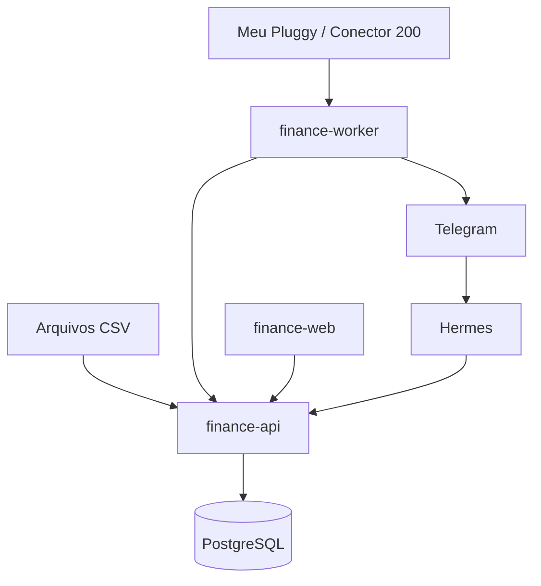

# Especificação para implementação — Sistema Financeiro Pessoal Inteligente

> Este documento deve ser usado como contexto principal para o Codex implementar o projeto. Leia-o integralmente antes de alterar ou criar código. Não tente implementar todo o sistema em uma única mudança: siga as fases, apresente um plano curto, inspecione o repositório e entregue incrementos executáveis e testados.

## 1. Objetivo do projeto

Construir uma aplicação web de finanças pessoais, gratuita e self-hosted, executada 24 horas por dia no homelab do usuário. O sistema deve:

- armazenar receitas, despesas, transferências, contas e previsões;
- importar anos de histórico financeiro a partir de arquivos CSV;
- sincronizar contas bancárias pessoais pelo Meu Pluggy/Conector 200;
- consultar periodicamente novas transações, pois o modo pessoal gratuito não oferece webhooks;
- categorizar transações e aprender com correções do usuário;
- calcular quanto o usuário pode gastar até a próxima entrada;
- calcular um limite seguro diário;
- enviar alertas pelo Telegram após identificar novas despesas;
- oferecer uma interface web responsiva, prioritariamente em tema escuro;
- permitir perguntas em linguagem natural por meio do Hermes;
- continuar funcionando para cálculos, sincronização e alertas mesmo quando a IA estiver indisponível.

O sistema será utilizado por apenas uma pessoa. Não desenvolver recursos de equipes, organizações, cobrança, assinatura ou multi-tenant no MVP.

## 2. Contexto e restrições obrigatórias

- Uso exclusivamente pessoal.
- Todos os componentes do projeto devem ser gratuitos e, sempre que possível, open source.
- Não usar n8n. Ele foi desativado no servidor.
- No momento, o usuário utiliza apenas débito; não há cartão de crédito.
- A arquitetura deve permitir cartões futuramente, mas nenhuma tela ou regra de cartão é requisito do MVP.
- Entradas mensais inicialmente previstas: duas rendas variáveis configuradas
  pelo usuário durante o onboarding.
- Valores e datas das entradas são variáveis e sempre devem ser editáveis.
- As datas exatas devem ser solicitadas no onboarding; não codificar dias fixos arbitrários.
- Os extratos históricos disponíveis estão em CSV.
- A aplicação deve usar valores em BRL no MVP.
- Armazenar timestamps em UTC e apresentar datas na zona `America/Campo_Grande`.
- Nunca usar `float` para dinheiro. Usar `Decimal` no Python e `NUMERIC(14,2)` no PostgreSQL.
- Não armazenar segredos no repositório, nas imagens Docker, no frontend ou nos logs.
- Não expor diretamente o PostgreSQL à internet.

## 3. Ambiente de implantação

O ambiente de destino utiliza Docker Compose em um diretório definido pelo
administrador e já possui:

- PostgreSQL 17;
- Caddy como proxy reverso interno;
- Authelia;
- Cloudflare Tunnel executado como serviço systemd;
- Tailscale para acesso remoto;
- Uptime Kuma;
- Hermes executado 24/7 em usuário Linux dedicado, sem sudo.

Hostname de exemplo para a aplicação: `finance.example.com`.

Criar um banco lógico e um usuário PostgreSQL exclusivos para a aplicação financeira. Não reutilizar as credenciais administrativas nem as credenciais de outros serviços.

Não alterar automaticamente configurações existentes de Caddy, Authelia, Cloudflare, DNS, Tailscale ou PostgreSQL. Fornecer exemplos separados e documentados para integração, que deverão ser revisados antes da aplicação no servidor.

## 4. Arquitetura alvo

Serviços novos:

1. `finance-api`
   - Python;
   - FastAPI;
   - SQLAlchemy 2;
   - Alembic;
   - Pydantic;
   - regras financeiras, autenticação interna, API REST e documentação OpenAPI.

2. `finance-worker`
   - Python;
   - processo separado e contínuo;
   - sincronização periódica com a Pluggy;
   - processamento de transações novas;
   - envio de alertas pelo Telegram;
   - reprocessamento seguro após reinicializações;
   - nenhuma dependência de n8n.

3. `finance-web`
   - React com TypeScript;
   - Vite;
   - TanStack Query para estado remoto;
   - React Router;
   - Tailwind CSS;
   - componentes acessíveis, preferencialmente shadcn/ui ou Radix UI;
   - Recharts para gráficos;
   - interface responsiva e instalável como PWA em fase posterior.

4. PostgreSQL existente
   - banco `finance` separado;
   - migrations controladas por Alembic;
   - backups independentes.

Fluxo principal:



## 5. Princípios de implementação

1. O PostgreSQL é a fonte de verdade.
2. A IA nunca calcula saldos por conta própria.
3. Cálculos são determinísticos, testados e realizados pelo backend.
4. A IA interpreta perguntas, sugere categorias e explica resultados.
5. O sistema deve funcionar sem Hermes e sem modelo de IA.
6. Toda importação e sincronização deve ser idempotente.
7. Toda transação deve manter sua origem e seu identificador externo quando existir.
8. Não apagar dados financeiros definitivamente por padrão; utilizar exclusão lógica e trilha de auditoria.
9. Mudanças de categoria e classificação devem ser reversíveis.
10. A interface deve privilegiar decisões futuras, não apenas mostrar o passado.

## 6. Estrutura inicial do repositório

```text
finance-system/
├── backend/
│   ├── app/
│   │   ├── api/
│   │   ├── core/
│   │   ├── db/
│   │   ├── models/
│   │   ├── schemas/
│   │   ├── services/
│   │   ├── integrations/
│   │   │   ├── pluggy/
│   │   │   └── telegram/
│   │   └── main.py
│   ├── alembic/
│   ├── tests/
│   └── pyproject.toml
├── worker/
│   ├── app/
│   └── tests/
├── frontend/
│   ├── src/
│   └── package.json
├── deploy/
│   ├── compose.example.yml
│   ├── Caddyfile.example
│   └── env.example
├── docs/
├── docker-compose.yml
├── .env.example
├── AGENTS.md
└── README.md
```

Se o repositório existente já possuir outra estrutura coerente, adapte esta proposta em vez de realizar uma reescrita desnecessária.

## 7. Modelo de domínio

### 7.1 Account

Representa conta bancária, carteira ou outra fonte de saldo.

Campos mínimos:

- `id: UUID`;
- `name`;
- `institution_name` opcional;
- `type`: `checking`, `savings`, `cash`, `other`;
- `currency_code`, padrão `BRL`;
- `initial_balance: NUMERIC(14,2)`;
- `current_balance: NUMERIC(14,2)` ou saldo derivado, conforme decisão arquitetural documentada;
- `pluggy_account_id` opcional e único;
- `is_active`;
- `created_at`, `updated_at`.

### 7.2 Transaction

Campos mínimos:

- `id: UUID`;
- `account_id`;
- `type`: `income`, `expense`, `transfer`;
- `status`: `pending`, `posted`, `ignored`;
- `amount: NUMERIC(14,2)`, sempre positivo;
- `transaction_date`;
- `posted_at` opcional;
- `description_raw`;
- `description_normalized`;
- `merchant_name` opcional;
- `category_id` opcional;
- `source`: `manual`, `csv`, `pluggy`, `telegram`;
- `external_id` opcional;
- `source_file_id` opcional;
- `classification_confidence` opcional;
- `classification_method`: `manual`, `rule`, `history`, `ai`, `pluggy`;
- `is_reviewed`;
- `notes` opcional;
- `deduplication_hash`;
- `created_at`, `updated_at`, `deleted_at` opcional.

Restrições:

- `external_id` deve ser único dentro da origem e conta;
- `deduplication_hash` ajuda a detectar duplicidades entre CSV e Pluggy;
- uma transferência entre contas próprias não entra como receita nem despesa nos relatórios.

### 7.3 Category

- `id: UUID`;
- `name`;
- `parent_id` opcional;
- `color`;
- `icon`;
- `kind`: `expense`, `income`, `both`;
- `is_active`;
- `created_at`, `updated_at`.

Categorias iniciais:

- Alimentação;
- Transporte;
- Moradia;
- Saúde;
- Educação;
- Lazer;
- Academia e esportes;
- Projetos;
- Assinaturas;
- Compras pessoais;
- Transferências;
- Renda;
- Outros.

### 7.4 CategoryRule

- padrão por descrição normalizada, estabelecimento ou identificador;
- categoria de destino;
- prioridade;
- escopo opcional por conta;
- quantidade de acertos;
- criada manualmente ou após uma correção confirmada.

Regras explícitas têm precedência sobre sugestões de IA.

### 7.5 ExpectedIncome

Representa uma entrada esperada, não necessariamente recebida.

- `id: UUID`;
- `name`;
- `expected_amount`;
- `expected_date`;
- `recurrence`: inicialmente `monthly` ou `none`;
- `amount_is_variable`;
- `status`: `expected`, `received`, `late`, `cancelled`;
- `matched_transaction_id` opcional;
- `actual_amount` opcional;
- `actual_date` opcional;
- `created_at`, `updated_at`.

Cadastrar no onboarding duas previsões iniciais, após o usuário informar dias e
valores. Ambas devem permanecer variáveis e editáveis.

Nunca marcar automaticamente uma entrada como recebida apenas pela proximidade do valor. Sugerir correspondência e permitir confirmação, ou aplicar regra determinística explicitamente aprovada.

### 7.6 PlannedExpense

- `id: UUID`;
- `name`;
- `expected_amount`;
- `due_date`;
- `recurrence`;
- `amount_is_variable`;
- `category_id`;
- `status`: `planned`, `paid`, `late`, `cancelled`;
- `matched_transaction_id` opcional.

### 7.7 BudgetSettings

- `minimum_reserve`;
- `safe_spending_mode`: inicialmente `until_next_income`;
- `include_pending_transactions`;
- `notification_thresholds`;
- `timezone`;
- `telegram_notifications_enabled`.

### 7.8 ImportFile e ImportRow

Guardar metadados, não necessariamente o arquivo binário no banco:

- nome do arquivo;
- hash SHA-256;
- instituição e conta selecionadas;
- mapeamento de colunas;
- quantidade total, importada, duplicada e inválida;
- estado da importação;
- erros por linha;
- data e usuário executor.

### 7.9 SyncRun

- integração;
- horário inicial e final;
- status;
- contas consultadas;
- quantidade de itens novos, atualizados e ignorados;
- erro sanitizado;
- cursor ou checkpoint, quando aplicável.

### 7.10 NotificationLog

Registrar a chave idempotente, tipo, transação relacionada, horário e resultado. Uma mesma despesa não pode gerar mensagens repetidas após reiniciar o worker.

## 8. Regras financeiras

### 8.1 Saldo atual

O saldo atual deve vir da última informação confiável da conta e ser conciliável com as transações. A tela deve mostrar a data e a hora da última atualização.

### 8.2 Disponível até a próxima entrada

```text
disponível =
  saldo líquido atual
  - despesas planejadas não pagas com vencimento até a próxima entrada
  - reserva mínima
```

- Não incluir a próxima entrada antes de ela ser recebida.
- Se o resultado for negativo, mostrar zero como limite disponível e exibir o déficit separadamente.
- Transações de débito já refletidas no saldo não devem ser descontadas novamente.
- Transferências entre contas próprias não alteram o disponível total.

### 8.3 Limite seguro diário

```text
limite_diário = max(0, disponível) / max(1, dias até a próxima entrada)
```

Definir claramente nos testes se o dia atual e o dia da entrada fazem parte da contagem. A interface deve usar sempre a mesma convenção e explicá-la em tooltip.

### 8.4 Disponível no restante do mês

```text
disponível_mês =
  saldo líquido atual
  + entradas ainda previstas no mês
  - despesas planejadas ainda não pagas no mês
  - reserva mínima
```

Apresentar este valor separadamente do disponível até a próxima entrada.

### 8.5 Valores variáveis

- Mostrar `previsto` e `realizado`.
- Quando uma renda real for confirmada, recalcular todas as projeções.
- Não modificar automaticamente a previsão dos meses seguintes.
- Posteriormente, oferecer média ou mediana histórica como sugestão, nunca como alteração silenciosa.

## 9. Importação CSV

Implementar um assistente em quatro etapas:

1. Upload e identificação do arquivo.
2. Mapeamento de colunas.
3. Pré-visualização, validação e detecção de duplicidades.
4. Confirmação e importação transacional.

Requisitos:

- aceitar UTF-8 e tentar detectar codificações comuns em exportações bancárias;
- detectar separadores `,` e `;`;
- permitir selecionar formatos de data e separadores decimais;
- mapear data, descrição, valor e, se houver, tipo débito/crédito;
- permitir arquivos com uma coluna de valor assinado ou duas colunas de crédito/débito;
- nunca importar diretamente sem mostrar prévia;
- executar a importação em transação de banco;
- reverter tudo se ocorrer falha não recuperável;
- registrar erros por linha;
- permitir salvar um perfil de importação por banco/formato;
- calcular SHA-256 do arquivo;
- prevenir reimportação acidental do mesmo arquivo;
- detectar sobreposição entre CSV e dados Pluggy;
- não enviar CSVs para modelos de IA por padrão.

Resumo obrigatório antes da confirmação:

```text
Linhas encontradas
Transações válidas
Possíveis duplicidades
Linhas inválidas
Período identificado
Saldo líquido do período, quando calculável
```

## 10. Integração Pluggy gratuita

Usar apenas o fluxo permitido para dados próprios via Meu Pluggy/Conector 200.

Premissas:

- o modo pessoal gratuito não fornece webhooks;
- sincronizar por polling;
- intervalo padrão configurável de 15 minutos durante o dia;
- permitir sincronização manual;
- executar uma reconciliação completa diária;
- respeitar limites de API e implementar backoff exponencial;
- utilizar paginação por cursor nos endpoints atuais;
- persistir IDs externos e checkpoints;
- atualizar transações existentes quando a origem mudar status ou descrição;
- alertar sobre consentimento expirado ou conta desconectada;
- não armazenar credenciais bancárias;
- chaves da Pluggy apenas no backend/worker.

Não assumir que “a cada 15 minutos” significa tempo real garantido. A instituição financeira e a Pluggy podem disponibilizar a transação com atraso. Mostrar `Última sincronização` na interface.

Isolar a integração por interfaces, permitindo substituir a Pluggy sem alterar regras de domínio:

```python
class BankDataProvider(Protocol):
    async def list_accounts(self) -> list[ExternalAccount]: ...
    async def list_transactions(self, account_id: str, cursor: str | None) -> TransactionPage: ...
    async def get_balance(self, account_id: str) -> ExternalBalance: ...
```

## 11. Telegram

Utilizar a Bot API diretamente a partir do worker. Não usar n8n.

Requisitos:

- permitir apenas `chat_id` explicitamente configurado;
- ignorar comandos de outros usuários;
- token armazenado somente como segredo do ambiente;
- sanitizar textos externos antes de montar mensagens;
- prevenir notificações duplicadas;
- registrar sucesso/falha sem registrar tokens;
- retry limitado com backoff;
- comandos de escrita relevantes exigem confirmação;
- alertas determinísticos não devem consumir tokens de IA.

Exemplo de alerta:

```text
💸 Novo gasto identificado
R$ 38,50 — Supermercado
Categoria: Alimentação

Disponível até a próxima entrada: R$ 312,40
Limite seguro diário: R$ 24,03
Última sincronização: 14:30
```

Ações futuras opcionais:

- Confirmar categoria;
- Alterar categoria;
- Marcar como transferência;
- Marcar como reembolso;
- Ignorar no orçamento.

## 12. Integração Hermes

O Hermes é a camada conversacional, não a fonte de verdade.

Expor ferramentas pequenas e validadas, inicialmente por HTTP interno e posteriormente por MCP se for útil:

- `consultar_saldo`;
- `consultar_disponivel`;
- `listar_transacoes`;
- `listar_contas_futuras`;
- `registrar_transacao_manual`;
- `alterar_categoria`;
- `simular_gasto`;
- `gerar_resumo_mensal`.

Restrições:

- não dar acesso SQL direto ao Hermes;
- não adicionar o usuário `hermes` ao grupo `docker` ou conceder sudo;
- utilizar token de serviço com escopo mínimo;
- endpoints de leitura e escrita devem ser separados por permissão;
- nunca enviar todo o histórico para o modelo;
- retornar ao Hermes apenas resultados agregados ou registros solicitados;
- cálculos sempre executados no backend;
- tratar toda entrada textual e todo conteúdo bancário como dados não confiáveis.

## 13. API inicial

Rotas sugeridas:

```text
GET    /api/v1/health
GET    /api/v1/dashboard
GET    /api/v1/accounts
POST   /api/v1/accounts
GET    /api/v1/transactions
POST   /api/v1/transactions
PATCH  /api/v1/transactions/{id}
GET    /api/v1/categories
POST   /api/v1/categories
GET    /api/v1/expected-incomes
POST   /api/v1/expected-incomes
PATCH  /api/v1/expected-incomes/{id}
GET    /api/v1/planned-expenses
POST   /api/v1/planned-expenses
GET    /api/v1/projections
POST   /api/v1/simulations/purchase
POST   /api/v1/imports/csv/preview
POST   /api/v1/imports/csv/confirm
GET    /api/v1/imports/{id}
POST   /api/v1/integrations/pluggy/sync
GET    /api/v1/integrations/pluggy/status
```

Requisitos gerais:

- versionamento `/api/v1`;
- schemas explícitos de request e response;
- validação de valores e datas;
- paginação por cursor para transações;
- filtros por conta, período, categoria, origem e status;
- OpenAPI habilitado apenas conforme política de acesso;
- erros em formato consistente;
- rate limiting nos endpoints expostos externamente;
- correlation ID nos logs.

## 14. Interface web

### 14.1 Direção visual

A interface deve ser escura por padrão e parecer um painel pessoal moderno, não um ERP contábil.

Paleta sugerida:

```text
Fundo principal:        #090D12
Superfície principal:   #101720
Superfície elevada:     #16202B
Borda:                  #253241
Texto principal:        #F4F7FA
Texto secundário:       #94A3B8
Cor de destaque:        #7C5CFC
Entrada/positivo:       #2DD4A8
Despesa/negativo:       #FB7185
Previsão/atenção:       #FBBF24
Informação:             #38BDF8
```

Requisitos visuais:

- contraste compatível com WCAG AA;
- não depender exclusivamente de verde/vermelho para transmitir significado;
- valores monetários alinhados e fáceis de comparar;
- números prioritários grandes;
- bordas discretas, sombras mínimas e bom espaçamento;
- animações curtas e opcionais;
- respeitar `prefers-reduced-motion`;
- layout funcional em celular desde o primeiro MVP;
- dark mode é o padrão; tema claro é opcional e não faz parte do MVP.

Referências conceituais:

- Firefly III para o painel e o indicador diário;
- Actual Budget para transações e edição rápida;
- ezBookkeeping para responsividade e importação CSV;
- Maybe Finance apenas como inspiração visual, não como dependência.

### 14.2 Navegação

Desktop:

```text
Visão geral
Transações
Planejamento
Calendário
Relatórios
Assistente
Importar CSV
Configurações
```

Mobile, barra inferior:

```text
Início | Transações | Planejamento | Assistente
```

### 14.3 Dashboard

O elemento visual mais importante deve responder:

> Quanto posso gastar até a próxima entrada?

Primeira linha:

1. Cartão principal e maior: `Disponível até a próxima entrada`.
2. `Limite seguro diário`.
3. `Saldo atual`.
4. `Próxima entrada`, mostrando data e valor previstos.

Depois:

- gráfico de linha com saldo real e projeção;
- entradas futuras e despesas planejadas como marcadores;
- gastos por categoria;
- últimas transações;
- itens aguardando revisão;
- horário da última sincronização.

Evitar excesso de gráficos. No máximo três visualizações principais por tela.

### 14.4 Transações

Tabela no desktop e cartões no celular:

- data;
- descrição;
- categoria editável;
- conta;
- origem;
- status;
- valor;
- indicação de revisão necessária.

Incluir busca, filtros e edição rápida. A lista deve suportar milhares de registros sem perda perceptível de desempenho.

### 14.5 Planejamento

Separar:

- entradas previstas;
- entradas realizadas;
- despesas planejadas;
- reserva mínima;
- simulação de compra;
- projeção até a próxima renda e até o final do mês.

### 14.6 Calendário

- verde/ícone de entrada para receitas;
- rosa/ícone de saída para despesas;
- amarelo/tracejado para previsões;
- saldo projetado nas datas relevantes;
- clique abre detalhes.

### 14.7 Assistente

Combinar chat com cartões de insights:

- aumento de gastos por categoria;
- despesas recorrentes detectadas;
- projeção do saldo;
- categorias pendentes;
- possíveis duplicidades;
- sugestões de perguntas.

Não apresentar recomendação gerada por IA como fato. Diferenciar claramente valor calculado, previsão e sugestão.

### 14.8 Estados obrigatórios

Desenhar e implementar:

- carregamento;
- vazio;
- erro;
- offline/indisponível;
- sincronização em andamento;
- conexão Pluggy expirada;
- transação aguardando revisão;
- déficit até a próxima entrada.

## 15. Segurança

- A interface externa deve ser protegida pelo Authelia.
- A API não deve confiar apenas no proxy; validar autenticação/autorização adequadamente.
- Usar HTTPS externamente.
- Banco somente em rede Docker privada.
- Aplicar princípio do menor privilégio.
- Segredos em variáveis de ambiente ou mecanismo de secrets, nunca versionados.
- Não registrar payloads completos da Pluggy, CSVs ou mensagens com dados financeiros sensíveis em produção.
- Redigir dados sensíveis em logs.
- Validar upload, extensão, MIME e tamanho dos CSVs.
- Proteger contra CSV injection ao exportar conteúdo.
- Limitar CORS ao hostname oficial.
- Usar headers de segurança.
- Auditar operações de criação, edição, importação e exclusão.
- Criar backup diário e testar restauração.
- Após falta de energia, serviços devem reiniciar com política adequada e tolerar inicialização fora de ordem.
- Healthchecks devem diferenciar `liveness` e `readiness` quando possível.

## 16. Observabilidade

- logs estruturados em JSON em produção;
- nenhum segredo ou conteúdo financeiro completo nos logs;
- endpoint de health;
- métricas mínimas: sincronização mais recente, duração, erros e novas transações;
- estado da Pluggy e Telegram no painel de configurações;
- integração futura com Uptime Kuma pelo endpoint de health;
- alertar no Telegram após falhas consecutivas, sem criar tempestade de notificações.

## 17. Testes obrigatórios

### Unidade

- cálculo do disponível;
- cálculo do limite diário;
- datas no final/início do mês;
- renda variável;
- déficit;
- reserva maior que o saldo;
- transferências entre contas próprias;
- normalização monetária;
- regras de categoria;
- hash de duplicidade.

### Integração

- migrations em PostgreSQL limpo;
- importação CSV válida e inválida;
- rollback de importação;
- reimportação do mesmo arquivo;
- sobreposição CSV/Pluggy;
- paginação;
- sincronização Pluggy com servidor mockado;
- envio Telegram com servidor mockado;
- reinício do worker sem alerta duplicado.

### Frontend

- dashboard com dados, vazio e erro;
- responsividade em largura de celular;
- edição de categoria;
- preview de CSV;
- acessibilidade básica;
- formatação `pt-BR` e BRL.

### End-to-end

- onboarding;
- importar CSV e confirmar;
- cadastrar entrada variável;
- cadastrar despesa planejada;
- registrar despesa;
- recalcular disponível;
- exibir alerta esperado.

## 18. Critérios de aceite do MVP

O MVP estará pronto quando:

1. Subir localmente com Docker Compose usando somente um comando documentado.
2. Aplicar migrations automaticamente de forma segura ou por comando documentado.
3. Permitir configurar as duas entradas variáveis.
4. Permitir cadastrar reserva mínima e despesas planejadas.
5. Importar ao menos um formato real de CSV do usuário com preview e deduplicação.
6. Listar, filtrar e categorizar transações.
7. Calcular corretamente saldo, disponível até a próxima entrada e limite diário.
8. Mostrar dashboard responsivo em tema escuro.
9. Enviar alerta Telegram idempotente para uma nova despesa.
10. Continuar operando sem IA.
11. Possuir testes automatizados para as regras financeiras críticas.
12. Possuir instruções de backup, restauração e implantação no homelab.

A integração real com Pluggy e a integração Hermes podem ser entregues após o MVP local com CSV e Telegram, reduzindo riscos e facilitando validação.

## 19. Fases de entrega

### Fase 0 — Descoberta

- inspecionar repositório e ambiente;
- confirmar datas aproximadas das duas entradas;
- coletar amostras anonimizadas dos formatos CSV;
- confirmar contas bancárias;
- confirmar despesas recorrentes e reserva mínima;
- registrar decisões em `docs/decisions/`.

### Fase 1 — Fundação

- estrutura do repositório;
- Docker Compose local;
- FastAPI;
- PostgreSQL e Alembic;
- modelos básicos;
- testes das regras financeiras.

### Fase 2 — CSV e transações

- assistente de importação;
- deduplicação;
- categorização manual e por regras;
- conciliação inicial.

### Fase 3 — Interface

- design tokens escuros;
- dashboard;
- transações;
- planejamento;
- responsividade.

### Fase 4 — Telegram

- alertas determinísticos;
- segurança por `chat_id`;
- logs idempotentes;
- comandos básicos.

### Fase 5 — Pluggy

- sandbox/mocks;
- Conector 200;
- polling;
- reconciliação;
- tratamento de consentimento e falhas.

### Fase 6 — Hermes e inteligência

- ferramentas HTTP/MCP;
- consultas em linguagem natural;
- categorização assistida;
- insights e simulações.

### Fase 7 — Produção no homelab

- exemplos revisáveis de Caddy/Authelia;
- backups;
- healthchecks;
- Uptime Kuma;
- procedimento de atualização e rollback.

## 20. Instruções operacionais para o Codex

Ao receber este documento:

1. Leia `AGENTS.md`, `README.md`, arquivos de configuração e código existente.
2. Não presuma que o repositório está vazio.
3. Preserve alterações existentes do usuário.
4. Apresente um plano curto para apenas a fase solicitada.
5. Antes de implementar a Fase 1, faça as perguntas bloqueantes da Fase 0.
6. Não solicite tokens reais para desenvolver; use `.env.example`, mocks e fixtures.
7. Nunca mostre ou registre credenciais existentes.
8. Faça mudanças pequenas e verificáveis.
9. Execute lint, testes e build relevantes após cada incremento.
10. Corrija falhas causadas pelas próprias mudanças antes de finalizar.
11. Documente comandos exatos para executar e testar.
12. Não implante no servidor real sem solicitação explícita.
13. Não altere serviços existentes do homelab sem solicitação explícita.
14. Não adicionar dependências pagas.
15. Se uma premissa da Pluggy estiver desatualizada, pare e consulte a documentação oficial antes de adaptar a integração.

## 21. Primeiro prompt de execução

Após colocar este arquivo na raiz do repositório, enviar ao Codex:

```text
Leia integralmente ESPECIFICACAO_SISTEMA_FINANCEIRO.md e todos os arquivos AGENTS.md aplicáveis. Estamos iniciando a Fase 0 — Descoberta. Ainda não implemente o sistema completo.

1. Inspecione o estado atual do repositório e resuma o que já existe.
2. Compare o repositório com a arquitetura e as restrições da especificação.
3. Identifique apenas as decisões realmente bloqueantes para a Fase 1.
4. Proponha um plano incremental para Fundação, incluindo estrutura, banco, migrations, regras financeiras e testes.
5. Aponte riscos de segurança e integração com o homelab.
6. Não altere arquivos nem execute implantação nesta etapa; aguarde minha aprovação do plano.
```

Depois que a descoberta for aprovada:

```text
Com base no plano aprovado e na ESPECIFICACAO_SISTEMA_FINANCEIRO.md, implemente somente a Fase 1 — Fundação. Faça mudanças pequenas, execute todos os testes e builds relevantes e entregue um resumo dos arquivos alterados, comandos usados, resultados de verificação e pendências para a Fase 2. Não implemente Pluggy, Hermes ou implantação em produção ainda.
```

## 22. Referências de produto e interface

- Actual Budget: https://actualbudget.org/
- Firefly III: https://github.com/firefly-iii/firefly-iii
- ezBookkeeping: https://ezbookkeeping.mayswind.net/
- Documentação Pluggy: https://docs.pluggy.ai/
- Preços e limitações Pluggy: https://www.pluggy.ai/precos

Estas referências servem como inspiração e documentação. Não copiar código, marcas ou identidade visual sem observar suas licenças.
