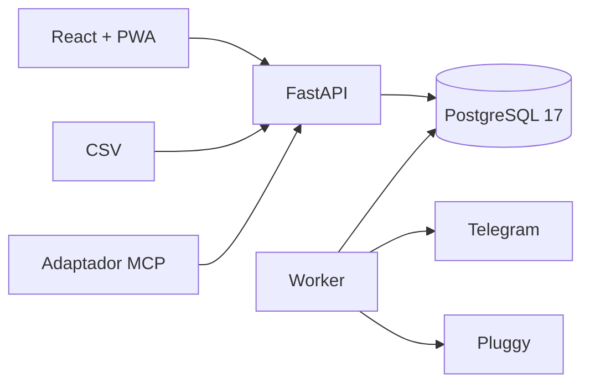

<div align="center">

# Finance System

**Finanças pessoais self-hosted, previsíveis e sob seu controle.**

Dashboard responsivo, planejamento financeiro, importação CSV idempotente e
integrações opcionais — sem entregar o cálculo do seu saldo a uma IA.


</div>

> [!IMPORTANT]
> Este é um projeto pessoal em desenvolvimento. Antes de expô-lo à internet,
> configure autenticação, HTTPS, backups e segredos adequados ao seu ambiente.

## O que ele faz

- acompanha contas, receitas, despesas e transferências;
- calcula saldo, valor disponível e limite seguro diário com regras
  determinísticas no backend;
- planeja entradas, despesas futuras e reserva mínima;
- importa extratos CSV com prévia, validação, deduplicação e confirmação;
- oferece dashboard escuro e responsivo, também instalável como PWA;
- envia alertas idempotentes e comandos de consulta pelo Telegram;
- sincroniza contas pela Pluggy com polling e reconciliação;
- expõe ferramentas com escopos mínimos para assistentes via adaptador MCP;
- mantém auditoria, exclusão lógica e valores monetários com precisão decimal.

Integrações externas e modelos de IA nunca calculam saldos: o PostgreSQL é a
fonte de verdade e as regras financeiras continuam funcionando offline.

## Arquitetura



| Camada | Responsabilidade |
| --- | --- |
| `frontend/` | Interface React, TypeScript e Vite |
| `backend/` | API, domínio financeiro, migrations e worker |
| `hermes-mcp/` | Adaptador MCP isolado e com permissões por escopo |
| `docs/decisions/` | Decisões arquiteturais do projeto |
| `deploy/` | Exemplos revisáveis de instalação e operação |

## Início rápido

### Pré-requisitos

- Docker Engine ou Docker Desktop;
- Docker Compose v2.

Nenhuma credencial externa é necessária para executar o ambiente local.

```bash
git clone git@github.com:joaoAlvesx/finance-system.git
cd finance-system
cp .env.example .env
docker compose up --build -d
```

Depois da inicialização:

| Serviço | Endereço local |
| --- | --- |
| Interface | <http://127.0.0.1:5173> |
| API | <http://127.0.0.1:8000/api/v1> |
| OpenAPI | <http://127.0.0.1:8000/docs> |
| Healthcheck | <http://127.0.0.1:8000/api/v1/health> |

Para acompanhar ou encerrar os serviços:

```bash
docker compose logs -f
docker compose down
```

`docker compose down` preserva o volume do banco. Evite `down -v` quando quiser
manter os dados.

## Configuração

O arquivo `.env.example` contém apenas valores locais fictícios. Copie-o para
`.env` e mantenha o arquivo real fora do Git.

As integrações Telegram e Pluggy começam desativadas. Ative-as somente depois de
preencher suas próprias credenciais no `.env` local. O sistema não precisa delas
para contas, planejamento, importação CSV ou cálculos financeiros.

Princípios importantes:

- dinheiro usa `Decimal` no Python e `NUMERIC(14,2)` no PostgreSQL;
- timestamps são armazenados em UTC;
- datas civis são apresentadas em `America/Campo_Grande` por padrão;
- arquivos CSV, dumps, tokens e dados financeiros reais não devem ser
  versionados.

## Importação CSV

O fluxo evita gravações acidentais:

1. envie o arquivo e selecione a conta;
2. revise o preview, linhas inválidas e possíveis duplicidades;
3. confirme explicitamente a importação;
4. acompanhe o resultado e a trilha de auditoria.

O SHA-256 do arquivo impede reimportações acidentais, e a confirmação é executada
em uma transação no banco. O projeto inclui um perfil para extratos em BRL com
datas `dd/mm/aaaa`, separador `;` e valores assinados.

## Testes e qualidade

Backend e migrations, sempre em banco isolado com nome terminado em `_test`:

```bash
docker compose --profile test run --build --rm tests
docker compose --profile test down
```

Frontend:

```bash
docker compose --profile test run --rm web-tests
```

Execução local para desenvolvimento do backend:

```bash
.venv/bin/ruff check backend hermes-mcp
.venv/bin/pytest backend/tests hermes-mcp/tests
```

## Integrações opcionais

<details>
<summary><strong>Telegram</strong></summary>

O worker usa a Bot API diretamente, limita comandos ao `chat_id` configurado e
registra notificações com chave idempotente. Os comandos iniciais são `/saldo` e
`/disponivel`. Tokens ficam somente no ambiente do worker.

</details>

<details>
<summary><strong>Pluggy</strong></summary>

A sincronização usa polling, cursor e uma janela de reconciliação. Cada conta
externa precisa ser vinculada a uma conta local, e registros já importados por
CSV são associados sem duplicação quando há correspondência determinística.

</details>

<details>
<summary><strong>Assistente e MCP</strong></summary>

O adaptador MCP acessa somente a API e usa tokens com escopos separados para
leitura, simulação, sugestão e escrita. Escritas exigem permissão e confirmação
explícitas. Banco, Docker e diretórios do host não são expostos ao assistente.

</details>

## Segurança e privacidade

- `.env`, extratos, dumps, bancos locais e artefatos de build são ignorados;
- exemplos usam valores fictícios e integrações desativadas;
- logs não devem conter tokens, descrições bancárias ou valores completos;
- CSVs não são enviados a modelos de IA;
- uploads têm validação de extensão, MIME e tamanho;
- a API deve ficar atrás de autenticação e HTTPS em qualquer exposição externa.

Encontrou uma vulnerabilidade? Evite publicar credenciais ou dados financeiros
em uma issue. Revogue qualquer segredo potencialmente exposto antes de relatar o
problema de forma privada ao mantenedor.

## Documentação

- [Especificação do sistema](ESPECIFICACAO_SISTEMA_FINANCEIRO.md)
- [Decisões arquiteturais](docs/decisions/)
- [Instalação do adaptador MCP](deploy/README.md)
- [Guia para outra máquina](instru%C3%A7oes/README.md)

## Estado do projeto

A versão atual implementa as fases de fundação, CSV, interface, Telegram, Pluggy
e assistente. A implantação em produção depende de revisão e adaptação ao ambiente
de destino; os arquivos de `deploy/` são exemplos, não automação universal.
